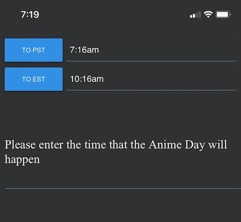

# Anime-Day
A Simple time converter for use for my friend and I to set up times to watch anime together.  
  
This Web app only supports PST to EST or EST to PST. But with spacetime it's not to hard to switch this to whatever you and you're friend are. But you would need to modify the code a little bit to be able to do that.  
  
```js
 function toPST(){
	EST = EST.time(document.getElementById('userTime').value); //take the user input
	document.getElementById('txtEST').value = EST.time(); //Since this input is already EST time put it into the EST label
	EST = EST.goto('America/Los_Angeles'); //Convert to PST
	document.getElementById('txtPST').value = EST.time(); //Put the PST time into the label
	EST = EST.goto('America/New_York'); //Convert the varible name back to it's orginal state
}
```
To change this to another time you would need to just change the `EST = EST.goto('America/Los_Angeles');`to the timezone you want to convert to. Than the `EST = EST.goto('America/New_York');` back to the timezone you are converting from. Make sure you change the variables on top as well. (Though if you are keeping an istence for yourself it would be recomended to change the varible names to not get confused) 
  
For example this funciton is to go to PST so it assumes the input time is EST. It than takes that time and populates the EST time. As no conversion is needed. Than using goto converts it to PST. Fills the text field with the time and than puts EST back into it's orginal state.  
  
Screenshot:  


This app uses [SpaceTime](https://github.com/spencermountain/spacetime) time libary. This is licenced under the Apache 2.0 license.
